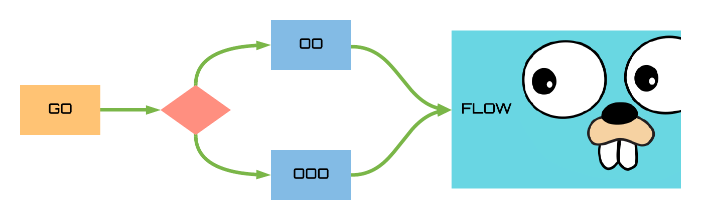
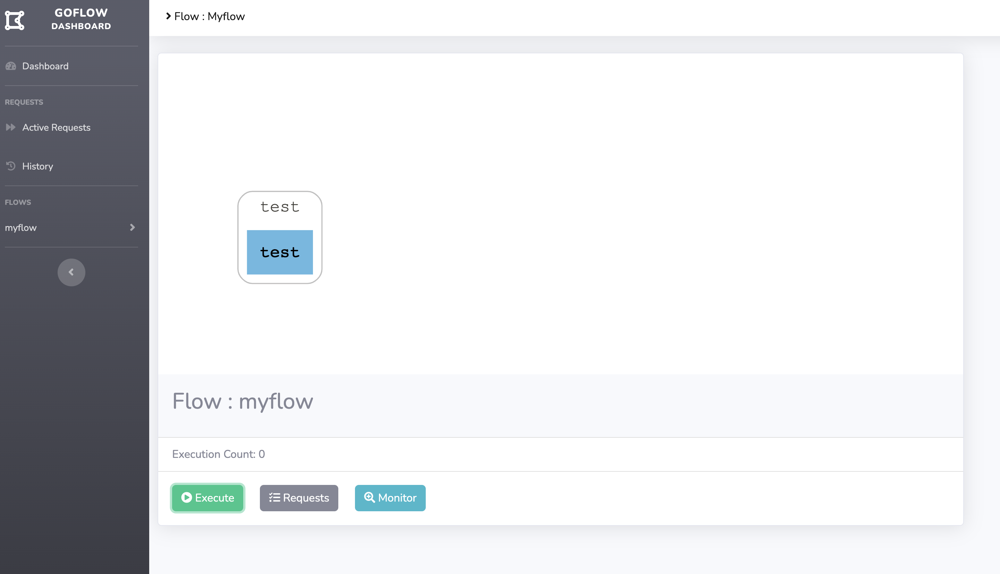
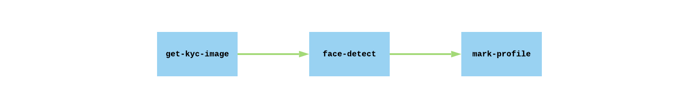
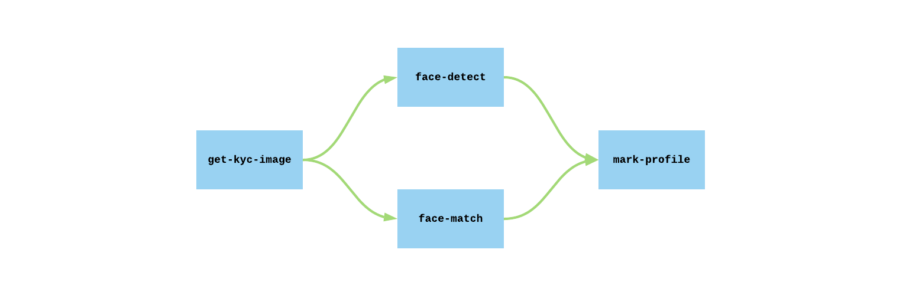
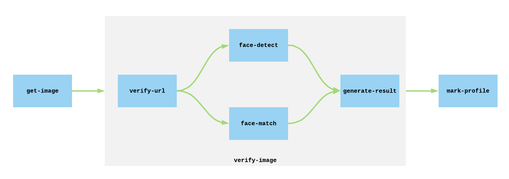
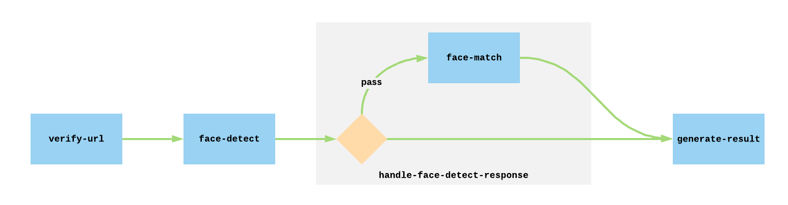
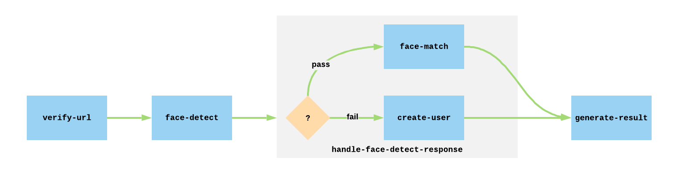
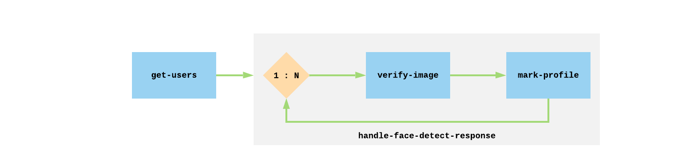

# Go-Flow  &nbsp; [](https://twitter.com/intent/tweet?text=Start%20writing%20your%20distributed%20workflow%20in%20Golang%20with%20GoFlow&url=https://github.com/s8sg/goflow&hashtags=golang,workflow,distributedcomputing,framework)

 
[](https://godoc.org/github.com/s8sg/goflow)




A Golang based high performance, scalable and distributed workflow framework

It allows to programmatically author distributed workflow as Directed Acyclic Graph (DAG) of tasks. 
GoFlow executes your tasks on an array of workers by uniformly distributing the loads 

## Install It 
Install GoFlow
```sh
go mod init myflow
go get github.com/s8sg/goflow@master
```

## Write First Flow
> Library to Build Flow `github.com/s8sg/goflow/flow/v1`

[](https://godoc.org/github.com/faasflow/goflow/flow)

Make a `flow.go` file
```go
package main

import (
	"fmt"
	goflow "github.com/s8sg/goflow/v1"
	flow "github.com/s8sg/goflow/flow/v1"
)

// Workload function
func doSomething(data []byte, option map[string][]string) ([]byte, error) {
	return []byte(fmt.Sprintf("you said \"%s\"", string(data))), nil
}

// Define provide definition of the workflow
func DefineWorkflow(workflow *flow.Workflow, context *flow.Context) error {
    dag := workflow.Dag()
    dag.Node("test", doSomething)
    return nil
}

func main() {
    fs := &goflow.FlowService{
        Port:                8080,
        RedisURL:            "localhost:6379",
        OpenTraceUrl:        "localhost:5775",
        WorkerConcurrency:   5,
        EnableMonitoring:    true,
    }
    fs.Register("myflow", DefineWorkflow)
    fs.Start()
}
```
> `Start()` runs a HTTP Server that listen on the provided Port. It also runs a flow worker that handles the workload

## Run It 
Start goflow stack
```sh
docker-compose up
```
This will start the required services 
* redis
* jaeger
* dashboard


Run the Flow
```sh
go build -o goflow
./goflow
```

## Invoke It

### Using curl
```sh
curl -d hallo localhost:8080/myflow
```

### Using Client

Using the goflow client you can request the flow directly. 
The requests are always async and gets queued for the workers to pick up
```go
fs := &goflow.FlowService{
    RedisURL: "localhost:6379",
}
fs.Execute("myflow", &goflow.Request{
    Body: []byte("hallo")
})
```

### Using Dashboard
Dashboard visualize the flow and provides observability


## Scale It
GoFlow scale horizontally, you can distribute the load by just adding more instances

#### Worker Mode
Alternatively you can start your GoFlow in worker mode. As a worker, GoFlow only handles the workload instead
of running an HTTP server. If required you can only scale the workers 
```go
fs := &goflow.FlowService{
    RedisURL:            "localhost:6379",
    OpenTraceUrl:        "localhost:5775",
    WorkerConcurrency:   5,
}
fs.Register("myflow", DefineWorkflow)
fs.StartWorker()
```

#### Register Multiple Flow
`Register()` allows user to bind multiple flows onto single flow service. 
This way one instance of server/worker can be used for more than one flows
```go
fs.Register("createUser", DefineCreateUserFlow)
fs.Register("deleteUser", DefineDeleteUserFlow)
```` 
<br />

## Creating More Complex DAG

The initial example is a single vertex DAG.
Single vertex DAG are great for synchronous task

Using [GoFlow's DAG construct](https://godoc.org/github.com/faasflow/lib/goflow#Dag) one can achieve more complex compositions
with multiple vertexes and connect them using edges.

### Multi Nodes

A multi-vertex flow is always asynchronous in nature where each nodes gets
distributed across the workers

Below is an example of a simple multi vertex flow to validate a KYC image of a user and mark the user according to the result.
This is a asynchronous flow with three steps 

```go
func DefineWorkflow(f *flow.Workflow, context *flow.Context) error {
    dag := f.Dag()
    dag.Node("get-kyc-image", getPresignedURLForImage)
    dag.Node("face-detect", detectFace)
    dag.Node("mark-profile", markProfileBasedOnStatus)
    dag.Edge("get-kyc-image", "face-detect")
    dag.Edge("face-detect", "mark-profile")
    return nil
}
```


### Branching
Branching are great for parallelizing independent workloads in separate branches

Branching can be achieved with simple vertex and edges. GoFlow provides a special operator [Aggregator](https://godoc.org/github.com/faasflow/lib/goflow#Aggregator) to aggregate result of multiple branch on a converging node

We are extending our earlier example to include a new requirement to match the face with existing data 
and we are performing the operation in parallel to reduce time


```go
func DefineWorkflow(f *flow.Workflow, context *flow.Context) error {
    dag := f.Dag()
    dag.Node("get-kyc-image", getPresignedURLForImage)
    dag.Node("face-detect", detectFace)
    dag.Node("face-match", matchFace)
    // Here mark-profile depends on the result from face-detect and face-match, 
    // we are using a aggregator to create unified results
    dag.Node("mark-profile", markProfileBasedOnStatus, flow.Aggregator(func(responses map[string][]byte) ([]byte, error) {
       status := validateResults(responses["face-detect"],  responses["face-match"])
       return []byte(status), nil
    }))
    dag.Edge("get-kyc-image", "face-detect")
    dag.Edge("get-kyc-image", "face-match")
    dag.Edge("face-detect", "mark-profile")
    dag.Edge("face-match", "mark-profile")
    return nil
}
```

### Subdag
Subdag allows to reuse existing DAG by embedding it into DAG with wider functionality

[SubDag](https://godoc.org/github.com/faasflow/lib/goflow#Dag.SubDag) is available as a GoFlow DAG construct which takes
a separate DAG as an input and composite it within a vertex, where the vertex completion depends on the embedded DAG's 
completion
```go
func (currentDag *Dag) SubDag(vertex string, dag *Dag)
```

Say we have a separate flow that needs the same set of steps to validate a user. 
With our earlier example we can separate out the validation process into subdag and put it 
in a library that can be shared across different flows

```go
func KycImageValidationDag() *flow.Dag {
    dag := flow.NewDag()
    dag.Node("verify-url", s3DocExists)
    dag.Node("face-detect", detectFace)
    dag.Node("face-match", matchFace)
    dag.Node("generate-result", func(data []byte, option map[string][]string) ([]byte, error) {
                 return data, nil
            }, 
            flow.Aggregator(func(responses map[string][]byte) ([]byte, error) {
                status := validateResults(responses["face-detect"],  responses["face-match"])
                status = "failure"
                if status {
                   status = "success"
                }
                return []byte(status), nil
            }
    ))
    dag.Edge("verify-url", "face-detect")
    dag.Edge("verify-url", "face-match")
    dag.Edge("face-detect", "generate-result")
    dag.Edge("face-match", "generate-result")
    return dag
}
```
Our existing flow embeds the `KycImageValidation` DAG
```go
func DefineWorkflow(f *flow.Workflow, context *flow.Context) error {
    dag := f.Dag()
    dag.Node("get-image", getPresignedURLForImage)
    dag.SubDag("verify-image", common.KycImageValidationDag)
    dag.Node("mark-profile", markProfileBasedOnStatus)
    dag.Edge("get-image", "verify-image")
    dag.Edge("verify-image", "mark-profile")
    return nil
}
```


### Conditional Branching
Conditional branching is a great way to choose different execution path dynamically

GoFlow provides a DAG component called [ConditionalBranch](https://godoc.org/github.com/faasflow/lib/goflow#Dag.ConditionalBranch).
ConditionalBranch creates a vertex that composites different conditional branches as an individual subdags, each 
identified with a unique key resemble the condition

```
func (currentDag *Dag) ConditionalBranch(vertex string, conditions []string, condition sdk.Condition,
    options ...BranchOption) (conditiondags map[string]*Dag)
```

[Condition](https://godoc.org/github.com/faasflow/sdk#Condition) is a special handler that allows user to dynamically choose one or more
execution path based on the result from earlier node and return a set of condition Keys 

User gets the condition branches as a response where each branch specific dags are mapped against the specific condition.
User can farther define each branch using the DAG constructs

Below is the updated example with a conditional Branch where we are trying to call face-match only when face-detect passes

```go
func KycImageValidationDag() *flow.Dag {
    dag := flow.NewDag()
    dag.Node("verify-url", s3DocExists)
    dag.Node("face-detect", detectFace)
    // here face match happen only when face-detect is success
    branches = dag.ConditionalBranch("handle-face-detect-response", []string{"pass"}, func(response []byte) []string {
        response := ParseFaceDetectResponse(response)
        if response[0] == "pass" { return []string{"pass"}  }
        return []string{}
    })

    // On the pass branch we are performing the `face-match` . If condition `pass` 
    // is not matched execution of next node `generate-result` is continued

    branches["pass"].Node("face-match", matchFace)
    dag.Node("generate-result", generateResult)
    dag.Edge("verify-url", "face-detect")
    dag.Edge("face-detect", "handle-face-detect-response")
    dag.Edge("handle-face-detect-response", "generate-result")
    return dag
}
```

You can also have multiple conditional branch in a workflow and different nodes corresponding to each branch

Below is the updated example with two conditional Branches where we are trying to call face-match or create-user based on response from previous node

```go
func KycImageValidationDag() *flow.Dag {
    dag := flow.NewDag()
    dag.Node("verify-url", s3DocExists)
    dag.Node("face-detect", detectFace)
    // here face match happen only when face-detect is success
    // otherwise create-user is called
    branches = dag.ConditionalBranch("handle-face-detect-response", []string{"pass", "fail"}, 
        func(response []byte) []string {
           response := ParseFaceDetectResponse(response)
           if response.isSuccess() { return []string{"pass"}  }
           return []string{"fail"}
    })
    // On the pass branch we are performing the `face-match`
    branches["pass"].Node("face-match", matchFace)
    // on the fail branch we are performing `create-user`
    branches["fail"].Node("create-user", createUser)
  
    dag.Node("generate-result", generateResult)
    dag.Edge("verify-url", "face-detect")
    dag.Edge("face-detect", "handle-face-detect-response")
    dag.Edge("handle-face-detect-response", "generate-result")
    return dag
}
```

### Foreach Branching
Foreach branching allows user to iteratively perform a certain set of task for a range of values

GoFlow provides a DAG component called [ForEachBranch](https://godoc.org/github.com/faasflow/lib/goflow#Dag.ForEachBranch).
ForEachBranch creates a vertex composites of a subdag that defines the flow within the iteration

```
func (currentDag *Dag) ForEachBranch(vertex string, foreach sdk.ForEach, options ...BranchOption) (dag *Dag)
```

[ForEach](https://godoc.org/github.com/faasflow/sdk#ForEach) is a special handler that allows user to dynamically 
return a set of key and values. For each of the items in the returned set, the user defined dag will get executed 

User gets the foreach branch as a response and can define the flow using the DAG constructs

We are updating our flow to execute over a set of user that has been listed for possible fraud

```go
func DefineWorkflow(f *flow.Workflow, context *flow.Context) error {
    dag := f.Dag()
    dag.Node("get-users", getListedUsers)
    verifyDag = dag.ForEachBranch("for-each-user-verify", func(data []byte) map[string][]byte {
       users := ParseUsersList(data)
       forEachSet := make(map[string][]byte)
       for _, user := range users {
           forEachSet[user.id] = []byte(user.GetKycImageUrl())
       }
       return forEachSet
    })
    verifyDag.SubDag("verify-image", KycImageValidationDag)
    verifyDag.Node("mark-profile", markProfileBasedOnStatus)
    verifyDag.Edge("verify-image", "mark-profile")

    dag.Edge("get-users", "for-each-user-verify")
    return nil
}
```


 
